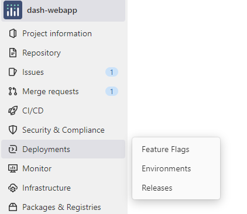
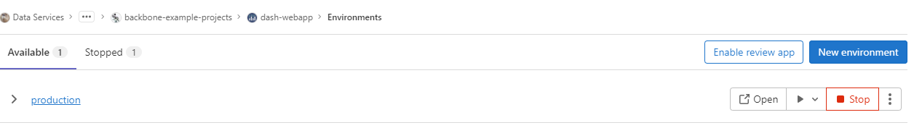
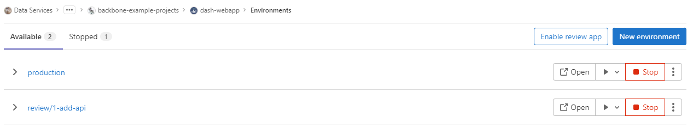
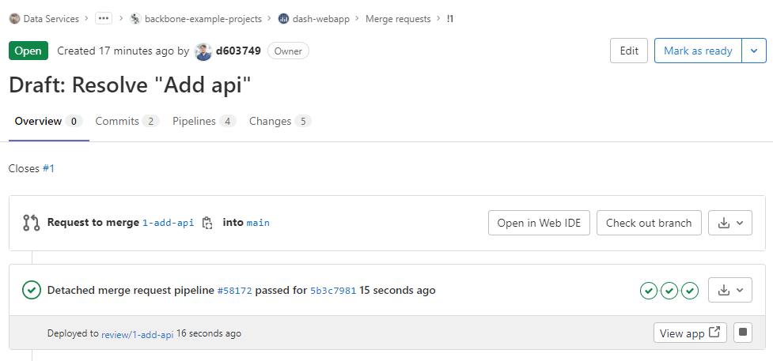

# Backbone Web kit

Template to deploy a dash webapp on a worker vm with traeffik and dozzle logs.
Please read this before forking.

- [Docs]({{ SITE_URL }})
- [API]({{ API_URL }})
- [Dash]({{ DASH_URL }})

## How to use

### first setup

#### Code

- fork it !
- remove the frok relationship in `setting/general/advanced`. This step is important as the forking relation prevents you from create a MR directly from an issue, which is at the heart of our workflow.
- in stack.yml, change only `BASE_URL` if you don't deploy this webapp on the backbone worker or have a different hostname.
  - demoapp (7) : your app's router name (without  special chars)
- in app/app.py, change :
  - app_name
  - credentials (or remove it)
- in assets, change `logo.JPG` and `favicon.ico` with the image you want as logo for your webapp
- change everyting in pages !

#### CI variables

If you can, set them up in your group !
- SSH_USER
- SSH_HOST
- SSH_PRIVATE_KEY

#### Adding env vars to your code
- to add env variables to your service, you can use the standard docker compose/swarm ways by modifying your `stack.yml` accordingly.

### Checking the app

The app will be hosted at `{BASEURL}/{CI_PROJECT_NAME}`. Chose your CI_PROJECT_NAME wisely before forking !!

Because we use gitlab environments, you can go to : deployement/environments to see you live deployements.

This will let you, among other things,  open the url in a new tab.

If you deploy  on  a standard worker  vm, you can check the  logs (even if the container is down) without  logging into the vm by going  to `{BASEURL}/logs` and searching for `{CI_PROJECT_NAME}_app`.

### Dev workflow

This project uses dynamic environment to let you dev in peace !
The `main` branch deploys to the `production environment`.

To add features : 
1. create an issue
2. create a merge request to solve said issue
3. make an initial commit

Now, a dynamic environment has been created under the name review/BRANCHNAME.
This allows you to preview your changes on a safe stack, distinct from your prod deployement.

Note that the environment shortcut is available directly in the MR view:

When you are satisfied, simply merge the MR (select delete source branch) and just like that your production environment is updated !

Review environments are automatically deleted where the branch is deleted (either manually or by merging).

